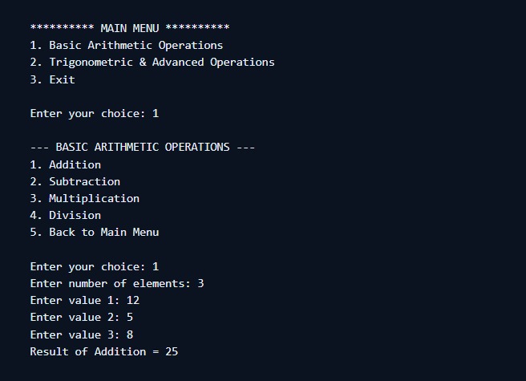

# 📊 Menu-Driven Calculator Application (Core Java)


## 📖 Project Description

The **Menu-Driven Calculator Application** is a command-line project developed using **Core Java**. It enables users to perform **basic arithmetic** and **advanced trigonometric operations** using a simple menu-driven approach.  

This project demonstrates key programming concepts such as **loops, conditional statements, arrays, exception handling, and Java’s built-in Math library**.


## 🎯 Objectives

- Design and implement a **console-based calculator** using Core Java.  
- Provide **basic operations**: addition, subtraction, multiplication, division.  
- Integrate **advanced operations**: power, square root, sine, cosine, tangent, logarithm.  
- Demonstrate **menu-driven programming** with switch-case.  
- Implement **exception handling** for invalid inputs.  
- Showcase **team collaboration** in software development.  


## ✨ Features

### 🔹 Basic Arithmetic Operations
- ➕ **Addition** – Add multiple numbers  
- ➖ **Subtraction** – Sequential subtraction of numbers  
- ✖ **Multiplication** – Multiply multiple numbers  
- ➗ **Division** – Compute quotient and remainder  

### 🔹 Trigonometric & Advanced Operations
- 🔼 **Power** – Base raised to exponent  
- √ **Square Root** – Uses `Math.sqrt()`  
- 🌐 **Sine** – `Math.sin()` (radians)  
- 🌐 **Cosine** – `Math.cos()` (radians)  
- 🌐 **Tangent** – `Math.tan()` (radians)  
- 📈 **Logarithm** – Natural logarithm with `Math.log()`  

### 🔹 Exit Menu
- Displays a **thank you message** with team members’ names  
- Terminates the program **gracefully**  


## 🛠 Tools & Technologies

- **Programming Language**: Core Java  
- **Editor**: VS Code  
- **Execution Environment**: Command-Line / Terminal  

### Core Concepts Used:
- Loops (`for`, `while`)  
- Decision-making (`switch-case`)  
- Arrays  
- Exception Handling (`try-catch`)  
- Java **Math Library**  


## ⚙️ Methodology

1. **Main Menu** – User selects category (Arithmetic, Advanced, Exit).  
2. **Sub-Menus** – Lists available operations.  
3. **User Input** – Values entered using `Scanner`.  
4. **Computation** – Operations performed with loops, arrays, and Math functions.  
5. **Output** – Results displayed in a structured format.  
6. **Exception Handling** – Prevents crashes on invalid input.  


## 🖥 Sample Output



## 📂 How to Run the Project

1. Clone the repository:
   ```bash
   git clone https://github.com/your-username/Calculator-project.git

✨ Now your README ends with a **“Thank You” section** that feels complete and professional.  

Do you also want me to make the **thank you message appear inside the program’s console output** (like after the user exits), or only in the README?


